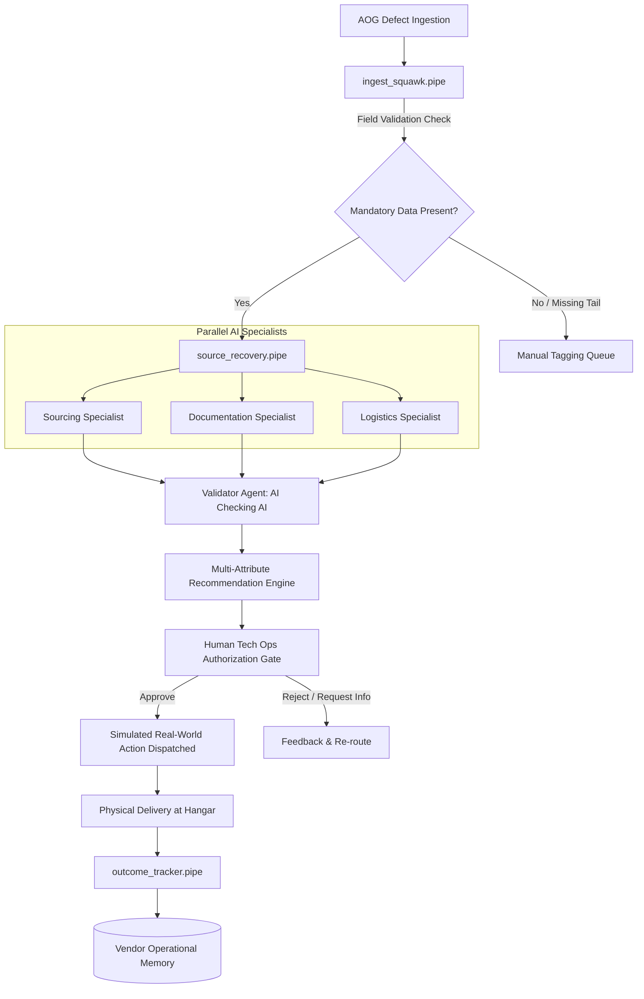

# SQUAWK — AI AOG Recovery Orchestrator

> **"From defect report to recovery plan — before the clock gets expensive."**


---

## 1. What SQUAWK Does
**SQUAWK** is an AI-powered operations control platform built for airline Technical Operations and MRO maintenance control centers (MCC) managing **Aircraft On Ground (AOG)** situations. 

When a critical defect grounds an aircraft, airlines lose upwards of **$150,000 per hour** in missed slots, passenger compensation, and gate holds. SQUAWK replaces fragmented phone calls, disconnected ERP searches, and slow manual spreadsheet comparisons with a **RocketRide multi-agent orchestration pipeline** that:
1. **Ingests & Normalizes** mixed-media defect reports (pilot ACARS, scanned TechLogs, radio voice notes, and webhooks).
2. **Executes Parallel AI Specialists** (Sourcing, Airworthiness Documentation Evidence, and Landed Logistics).
3. **Applies Load-Bearing Validator Checks (AI Checking AI)** to detect contradictions, compliance deficits, and impossible ETAs.
4. **Enforces Human-in-the-Loop Authorization** before issuing simulated procurement and dispatch actions.
5. **Updates Long-Term Vendor Memory** strictly through verified operational outcomes.

---

## 2. Architecture & Pipeline Topology



---

## 3. The Hero Demo Moment (`N42Q`)
SQUAWK is pre-seeded with a flagship demo scenario:
- **Aircraft**: `N42Q` (Boeing 737-800) at Chicago O'Hare (`ORD`).
- **Defect**: Engine-Driven Hydraulic Pump EDP low pressure warning (ATA 29). Part `HYD-PUMP-2901`.
- **The Sourcing Conflict**:
  - **Global Aviation Supply** offers the lowest part price ($14,900), but the **Documentation Specialist** discovers it is missing mandatory **FAA Form 8130-3** airworthiness tags.
  - **AeroParts Inc.** costs $19,800, but has **Dual Release (FAA 8130-3 + EASA Form 1)**, **94% historical vendor reliability**, and local **4-hour dedicated hot-shot van delivery**.
- **Validator Decision**:
  - Flags Global Aviation Supply as **CRITICAL COMPLIANCE DEFICIT**.
  - Elevates AeroParts Inc. to **#1 RECOMMENDED** recovery plan.

---

## 4. Key Features & Hackathon Requirements Checklist

| Requirement | Implementation in SQUAWK | Status |
| :--- | :--- | :---: |
| **Automatic Ingestion** | `/api/cases` intake webhook & parser handling defect JSON payloads | ✅ |
| **Batch Processing** | `/api/batch/process` concurrent queue runner for 15 cases with cost & runtime telemetry | ✅ |
| **Mixed Media** | Simulates PDF tech logs, borescope photos, and cockpit radio voice notes | ✅ |
| **Multi-Agent AI** | Parallel Sourcing, Documentation, and Logistics specialist agents | ✅ |
| **AI Validation** | Load-bearing `ValidatorAgent` reconciling specialist outputs & detecting contradictions | ✅ |
| **Human-in-the-Loop** | Dedicated Tech Ops Approval modal with A&P license capture & action authorization | ✅ |
| **Real-World Action** | Generates Purchase Orders (`SQ-XXXX`), EDI dispatches, and Work Order updates | ✅ |
| **Persistent Memory** | `VendorMemory` tracking on-time rates, average delay, and doc defect counts | ✅ |
| **Confidence/Risk Gating**| Composite risk score (`LOW` / `MEDIUM` / `HIGH` / `CRITICAL`) with manual tagging queues | ✅ |
| **Cost / Runtime Visibility**| Batch processing calculates compute cost ($0.021/case) and concurrency runtime (s) | ✅ |

---

## 5. RocketRide Integration Details
SQUAWK uses real `.pipe` pipeline files in `/pipelines`:
- [`ingest_squawk.pipe`](file:///pipelines/ingest_squawk.pipe): Ingestion, normalization, and missing-field routing.
- [`source_recovery.pipe`](file:///pipelines/source_recovery.pipe): Parallel specialist branches, validator cross-check, and human review gate.
- [`outcome_tracker.pipe`](file:///pipelines/outcome_tracker.pipe): Closed-loop physical outcome ingestion and memory weight updates.

The [`pipeline_runner.py`](file:///backend/app/pipeline_runner.py) module wraps `rocketride.RocketRideClient` and provides deterministic local fallback execution when `DEMO_MODE=true`.

---

## 6. How to Run Locally

### Prerequisites
- Python 3.10+
- Node.js 18+ and npm

### Step 1: Clone and Configure Environment
```bash
cp .env.example .env
```

### Step 2: Run Backend
```bash
cd backend
pip install -r requirements.txt
python -m uvicorn app.main:app --host 127.0.0.1 --port 8000 --reload
```
API Documentation will be live at `http://127.0.0.1:8000/docs`.

### Step 3: Run Frontend
In a separate terminal:
```bash
cd frontend
npm install
npm run dev
```
Open `http://localhost:5173` in your browser.

---

## 7. Airworthiness Compliance Disclaimer
> [!IMPORTANT]
> SQUAWK is an operations orchestration and decision-support tool. It does **not** make final airworthiness, legal, or maintenance release decisions. All recovery plans require manual review and authorization by certified A&P / Part 66 engineers.
